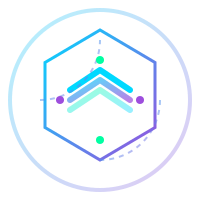

# 🤖 ArbitroBot Website

<div align="center">



**Мониторинг арбитражных транзакций в режиме реального времени**

[](https://nextjs.org/)
[](https://www.typescriptlang.org/)
[](https://tailwindcss.com/)
[](https://docs.ethers.org/)

[Демо](#) · [Документация](./ARCHITECTURE.md) · [Quick Start](./QUICK_START.md)

</div>

---

## 📋 О проекте

**ArbitroBot Website** — это современная веб-платформа для мониторинга арбитражных сделок на децентрализованных биржах (DEX) в блокчейне BNB Smart Chain.

### ✨ Ключевые возможности

- 🔄 **Real-time мониторинг** — живое отображение арбитражных транзакций
- 🔐 **Web3 авторизация** — безопасный вход через MetaMask/Trust Wallet
- 📊 **Личный кабинет** — детальная статистика и история ваших операций
- 🎨 **Современный дизайн** — темная тема с впечатляющими анимациями
- 📱 **Адаптивность** — отличная работа на любых устройствах
- ⚡ **Высокая производительность** — оптимизация и быстрая загрузка

---

## 🖼️ Скриншоты

### Главная страница
> *Мониторинг транзакций в реальном времени*


### Личный кабинет
> *Персональная статистика и история операций*


### Web3 Подключение
> *Интеграция с MetaMask и другими кошельками*


---

## 🚀 Быстрый старт

### Предварительные требования

- Node.js >= 18.0.0
- npm >= 9.0.0
- MetaMask (для Web3 функций)

### Установка

```bash
# 1. Клонировать репозиторий
git clone https://github.com/yourusername/arbitrobot-website.git
cd arbitrobot-website

# 2. Установить зависимости
npm install
npm install --save-dev express ws cors

# 3. Настроить environment variables
cp .env.example .env.local
# Отредактируйте .env.local при необходимости

# 4. Запустить mock backend (Terminal 1)
node mock-server.js

# 5. Запустить Next.js dev server (Terminal 2)
npm run dev

# 6. Открыть в браузере
# http://localhost:3000
```

Подробнее: [QUICK_START.md](./QUICK_START.md)

---

## 🏗️ Архитектура

### Tech Stack

**Frontend:**
- ⚛️ **Next.js 14** (App Router)
- 🔷 **TypeScript** (100% типизация)
- 🎨 **Tailwind CSS** + CSS Variables
- 🎬 **Framer Motion** (анимации)

**State Management:**
- 🐻 **Zustand** (глобальное состояние)
- 💾 **localStorage** (персистентность)

**Web3:**
- 🔗 **ethers.js v6** (блокчейн интеграция)
- 🦊 **MetaMask API** (подключение кошелька)

**API:**
- 🌐 **HTTP + WebSocket** (real-time обновления)
- 🔄 **Retry логика** (устойчивость к ошибкам)

### Структура проекта

```
src/
├── app/                    # Next.js App Router
│   ├── page.tsx           # Главная страница
│   └── dashboard/         # Личный кабинет
├── components/
│   ├── effects/           # Визуальные эффекты
│   ├── features/          # Фичи (Auth, Dashboard, Monitor)
│   ├── layout/            # Layout компоненты
│   └── ui/                # UI компоненты
└── lib/
    ├── api/               # API клиент + WebSocket
    ├── hooks/             # Custom React hooks
    ├── stores/            # Zustand stores
    └── web3/              # Web3 интеграция
```

Подробнее: [ARCHITECTURE.md](./ARCHITECTURE.md)

---

## 🎨 Дизайн-система

### Цветовая палитра

```css
--primary:   #00D9FF    /* Cyan */
--secondary: #9D4EDD    /* Purple */
--accent:    #00FFA3    /* Green */
--danger:    #FF4D6A    /* Red */
--warning:   #FFB800    /* Yellow */
```

### Эффекты

- **AnimatedBackground** — движущиеся орбы на фоне
- **CustomCursor** — кастомный курсор с подсветкой
- **3D Tilt** — интерактивные карточки с 3D эффектом
- **Animated Counters** — плавные анимации чисел
- **PageTransition** — переходы между страницами

---

## 📚 Документация

- 📖 [ARCHITECTURE.md](./ARCHITECTURE.md) — Детальная архитектура
- 🚀 [QUICK_START.md](./QUICK_START.md) — Быстрый старт
- 🔧 [MOCK_BACKEND.md](./MOCK_BACKEND.md) — Mock backend guide
- 📝 [SUMMARY.md](./SUMMARY.md) — Общий обзор проекта
- 📋 [docs/ЖИВОЙ_ЖУРНАЛ_РАЗРАБОТКИ.md](./docs/ЖИВОЙ_ЖУРНАЛ_РАЗРАБОТКИ.md) — История разработки

---

## 🧪 Тестирование

```bash
# TypeScript проверка
npm run type-check

# ESLint проверка
npm run lint

# Unit тесты (TODO)
npm test

# E2E тесты (TODO)
npm run test:e2e
```

---

## 🚀 Деплой

### Vercel (рекомендуется)

[](https://vercel.com/new/clone?repository-url=https://github.com/yourusername/arbitrobot-website)

### Ручной деплой

```bash
# Production build
npm run build

# Запуск production сервера
npm run start
```

### Environment Variables

```env
NEXT_PUBLIC_API_URL=https://your-api.com
NEXT_PUBLIC_WS_URL=wss://your-api.com
NEXT_PUBLIC_ETHERSCAN_API_KEY=your_key
```

---

## 🤝 Contributing

Мы приветствуем вклад в проект! Пожалуйста:

1. Fork репозиторий
2. Создайте feature branch (`git checkout -b feature/AmazingFeature`)
3. Commit изменения (`git commit -m 'Add AmazingFeature'`)
4. Push в branch (`git push origin feature/AmazingFeature`)
5. Откройте Pull Request

---

## 📝 Лицензия

Этот проект лицензирован под MIT License - см. [LICENSE](./LICENSE) файл.

---

## 🙏 Благодарности

- [Next.js](https://nextjs.org/) - React фреймворк
- [Tailwind CSS](https://tailwindcss.com/) - CSS фреймворк
- [Framer Motion](https://www.framer.com/motion/) - Анимации
- [ethers.js](https://docs.ethers.org/) - Web3 библиотека
- [Zustand](https://zustand-demo.pmnd.rs/) - State management

---

## 📞 Контакты

**Разработчик:** Claude Sonnet 4.5  
**Дата:** 2025-10-16  
**Версия:** 1.0.0 MVP

---

<div align="center">

**⭐ Если проект понравился, поставьте звезду! ⭐**

Made with ❤️ by Claude

</div>
